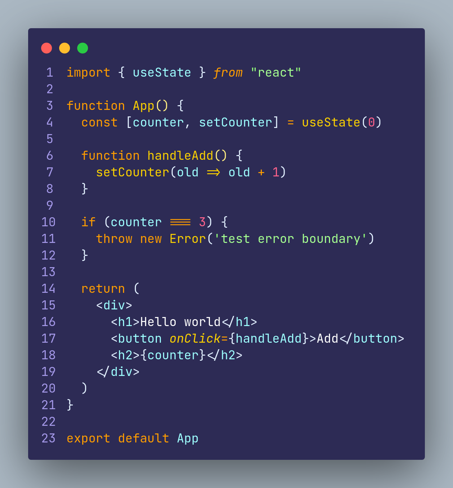

# Error boundaries no React

## O que são e para que servem os error boundaries
Os error boundaries são componentes que tem a função de capturar e lidar com os erros que ocorrem durante o processo de renderização, atualização ou ciclo de vida de um componente React filho. Normalmente os erros que acontecem durante esses processos em componentes React "quebram" a aplicação e a tornam inutilizável.

Ao usar um error boundary, você consegue "envolver" um componente, ou um grupo de componentes, para definir um comportamento alternativo caso ocorra um erro dos que foram citados anteriormente. Esse comportamento ajuda a garantir que mesmo se um erro desse tipo acontecer de forma inesperada, a sua aplicação continuará funcionando.

Esses componentes error boundaries são desenvolvidos utilizando a API do react "componentDidCatch", que é um método do ciclo de vida do componente que é chamado quando um erro é lançado na pilha durante a renderização, atualização ou ciclo de vida de um componente filho. Esse método deve ser implementado pelo pai, para que caso ocorra algum erro desse tipo nos filhos, ele capture esse erro.

Após pegar esse erro com o componentDidCatch, o error boundary tem a opção de renderizar algo alternativo em vez de renderizar o componente filho que gerou o erro. Esse comportamento alternativo pode ser uma simples mensagem de erro, ou um botão de recarregar a página, etc.

O mais importante para se ter em mente sobre os error boundaries, é que eles **apenas** capturam erros durante a atualização, renderização ou ciclo de vida dos componentes filhos, os error boundaries **não** vão capturar erros externos do React, como eventos (onClick, onChange, onSubmit), erros de sintaxe de arquivos script, erros de uma API externa, nem erros assíncronos. Por isso, é importante ressaltar que além de utilizar error boundaries, sua aplicação deve tratar os demais erros, utilizando try catches por exemplo. 

Outra coisa interessante de ser comentada, é que o React ainda **não** possui uma maneira nativa de criar error boundaries usando functional componentes, por isso se você quiser criar de forma nativa, você deve utilizar class components. Mas nada impede que você crie seus componentes normais usando functional componentes, e apenas seu error boundary com class.

 

## Como criar um error boundary

 

## Como envolver a aplicação em um error boundary

 

## Caso de uso que o error boundary pega o erro

 

## Caso de uso que o error boundary não pega o erro (o correto é utilizar try catch nesse caso)
